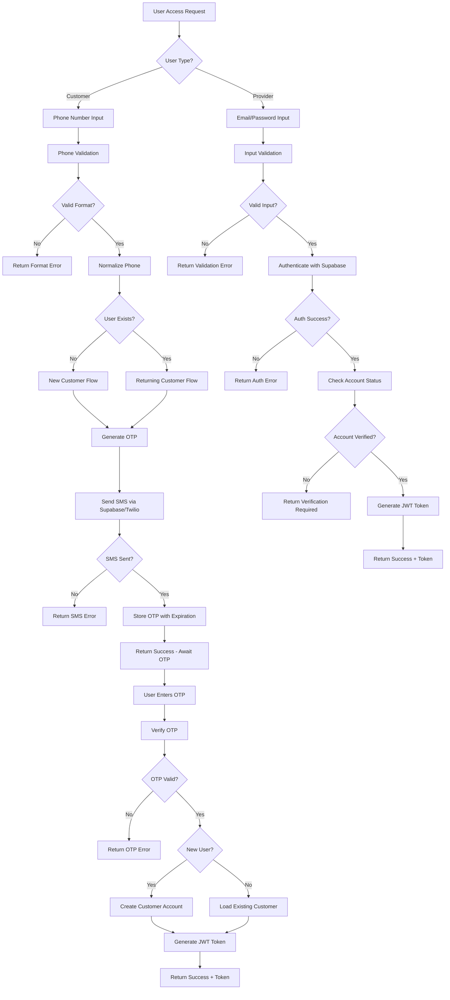

# Authentication Flow Analysis & Security Plan

## Overview

This document provides a comprehensive analysis of the BeautyCort authentication system, including user flows, security considerations, error handling strategies, and recommendations for implementing secure two-phase authentication.

## Current System Architecture

### User Types
- **Customers**: Phone-based OTP authentication (passwordless)
- **Providers**: Email/password authentication with manual verification

### Technology Stack
- JWT tokens for session management
- Supabase Auth for provider authentication
- Twilio (via Supabase) for SMS OTP delivery
- Mock OTP system for development

## User Flow Analysis

### 1. New Customer Flow

```
[Phone Input] → [Validation] → [OTP Generation] → [SMS Delivery] → [OTP Verification] → [Account Creation] → [JWT Token]
```

**Steps:**
1. Customer enters Jordan phone number
2. Phone validation (format: +962 7X XXXX XXXX)
3. OTP generated and sent via SMS
4. Customer enters received OTP
5. OTP verified against stored value
6. New customer record created in database
7. JWT token generated and returned

**Decision Points:**
- Phone format validation (accept/reject)
- Existing phone check (new/returning user)
- OTP verification (valid/invalid/expired)

### 2. Returning Customer Flow

```
[Phone Input] → [Validation] → [User Lookup] → [OTP Generation] → [SMS Delivery] → [OTP Verification] → [JWT Token]
```

**Steps:**
1. Customer enters registered phone number
2. Phone validation and normalization
3. Database lookup confirms existing account
4. OTP generated and sent via SMS
5. Customer enters received OTP
6. OTP verified against stored value
7. JWT token generated with existing user data

**Decision Points:**
- Phone format validation (accept/reject)
- User existence check (found/not found)
- OTP verification (valid/invalid/expired)

### 3. New Provider Flow

```
[Registration Form] → [Validation] → [Duplicate Check] → [Account Creation] → [Manual Verification] → [Account Approval]
```

**Steps:**
1. Provider submits registration form (email, password, business details, location)
2. Input validation (email format, password strength, required fields)
3. Check for duplicate email/phone
4. Create provider account in Supabase Auth
5. Store business details in database
6. Manual verification by admin
7. Account approved and login enabled

**Decision Points:**
- Form validation (complete/incomplete)
- Duplicate check (unique/duplicate)
- Account creation (success/failure)
- Manual verification (pending/approved/rejected)

### 4. Returning Provider Flow

```
[Email/Password] → [Validation] → [Authentication] → [Status Check] → [JWT Token]
```

**Steps:**
1. Provider enters email and password
2. Input validation
3. Authenticate against Supabase Auth
4. Check account verification status
5. Generate JWT token if verified

**Decision Points:**
- Input validation (valid/invalid)
- Authentication (success/failure)
- Account status (verified/unverified/suspended)

## Authentication Flow Diagram



## Security Analysis & Recommendations

### Current Security Issues

1. **Rate Limiting**: No protection against brute force attacks
2. **JWT Security**: Using default/weak secrets
3. **OTP Exposure**: Development mode exposes OTP codes
4. **Session Management**: No token blacklisting or refresh token rotation
5. **Audit Logging**: Limited tracking of authentication events

### Recommended Security Enhancements

#### 1. Rate Limiting Implementation

```typescript
interface RateLimitConfig {
  otpRequests: {
    maxAttempts: 3;
    windowMinutes: 60;
  };
  otpVerification: {
    maxAttempts: 5;
    windowMinutes: 10;
  };
  providerLogin: {
    maxAttempts: 5;
    windowMinutes: 15;
  };
}
```

#### 2. Enhanced OTP Security

- Reduce OTP expiration to 5 minutes
- Implement OTP complexity (6-digit numeric)
- Add OTP attempt tracking
- Invalidate OTP after successful verification

#### 3. JWT Improvements

- Use strong, environment-specific secrets
- Implement token blacklisting
- Add refresh token rotation
- Include device fingerprinting

#### 4. Account Lockout Policies

- Temporary lockout after failed attempts
- Progressive lockout duration
- Admin notification for suspicious activity

## Error Handling Strategy

### Client-Safe Error Messages

| Scenario | Client Message | Internal Log |
|----------|---------------|--------------|
| Invalid phone format | "Please enter a valid Jordan mobile number" | "Invalid phone format: {phone}" |
| Rate limit exceeded | "Too many requests. Please try again in {time}" | "Rate limit exceeded for {ip}: {phone}" |
| Invalid OTP | "Invalid verification code" | "OTP verification failed: {phone}, attempt {count}" |
| Account not verified | "Account pending verification" | "Unverified provider login: {email}" |
| General auth failure | "Invalid credentials" | "Auth failed: {reason}" |

### Error Response Format

```typescript
interface ErrorResponse {
  success: false;
  error: {
    code: string;
    message: string;
    retryAfter?: number; // For rate limiting
  };
}
```

## Data Response Specifications

### Successful OTP Send Response

```typescript
interface OTPSendResponse {
  success: true;
  message: string;
  data: {
    phone: string;
    expiresIn: number; // seconds
    // Development only:
    testOTP?: string;
    testMode?: boolean;
  };
}
```

### Successful Authentication Response

```typescript
interface AuthSuccessResponse {
  success: true;
  message: string;
  data: {
    user?: CustomerData;
    provider?: ProviderData;
    token: string;
    refreshToken?: string;
    expiresIn: number;
    type: 'customer' | 'provider';
  };
}
```

### Customer Data Structure

```typescript
interface CustomerData {
  id: string;
  phone: string;
  name?: string;
  email?: string;
  language: 'ar' | 'en';
  createdAt: string;
}
```

### Provider Data Structure

```typescript
interface ProviderData {
  id: string;
  email: string;
  businessNameAr: string;
  businessNameEn: string;
  ownerName: string;
  phone: string;
  verified: boolean;
  rating?: number;
  totalReviews?: number;
}
```

## Implementation Priority

### Phase 1: Security Hardening (Critical)
1. Implement rate limiting
2. Secure JWT configuration
3. Add audit logging
4. Enhance error handling

### Phase 2: User Experience (High)
1. Account lockout policies
2. Device fingerprinting
3. Session management improvements
4. Provider verification automation

### Phase 3: Advanced Features (Medium)
1. Multi-factor authentication
2. Biometric authentication support
3. Social login integration
4. Advanced fraud detection

## Database Schema Requirements

### Rate Limiting Table

```sql
CREATE TABLE auth_attempts (
    id UUID PRIMARY KEY DEFAULT uuid_generate_v4(),
    identifier VARCHAR(255) NOT NULL, -- phone/email/ip
    attempt_type VARCHAR(50) NOT NULL, -- otp_request, otp_verify, login
    created_at TIMESTAMP DEFAULT NOW(),
    ip_address INET,
    user_agent TEXT,
    INDEX idx_identifier_type_time (identifier, attempt_type, created_at)
);
```

### Audit Log Table

```sql
CREATE TABLE auth_audit_log (
    id UUID PRIMARY KEY DEFAULT uuid_generate_v4(),
    user_id UUID,
    user_type VARCHAR(20), -- customer, provider
    action VARCHAR(50), -- login_success, login_fail, otp_send, etc.
    ip_address INET,
    user_agent TEXT,
    details JSONB,
    created_at TIMESTAMP DEFAULT NOW(),
    INDEX idx_user_action_time (user_id, action, created_at)
);
```

## Testing Strategy

### Unit Tests Required
- Phone validation functions
- OTP generation and verification
- JWT token operations
- Rate limiting logic

### Integration Tests Required
- Complete authentication flows
- Error handling scenarios
- Rate limiting enforcement
- Database operations

### Security Tests Required
- Brute force attack simulation
- Token manipulation attempts
- Rate limit bypass attempts
- SQL injection prevention

## Monitoring & Alerting

### Key Metrics to Track
- Authentication success/failure rates
- OTP delivery success rates
- Rate limiting activations
- Account lockout events
- Suspicious activity patterns

### Alert Conditions
- High failure rates (>20% in 5 minutes)
- Rate limiting triggered frequently
- Multiple account lockouts
- Unusual geographic patterns
- Failed OTP verification spikes

## Compliance Considerations

### Data Privacy
- Minimal data collection
- Phone number encryption at rest
- GDPR compliance for EU users
- User consent management

### Security Standards
- OWASP authentication guidelines
- PCI DSS for payment processing
- SOC 2 compliance preparation
- Regular security audits

## Conclusion

The current authentication system provides a solid foundation but requires significant security enhancements before production deployment. The two-phase authentication approach is appropriate for the user types, but implementation of rate limiting, enhanced error handling, and comprehensive audit logging are critical for security and compliance.

Priority should be given to implementing the Phase 1 security hardening measures, followed by user experience improvements and advanced features.
